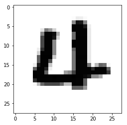
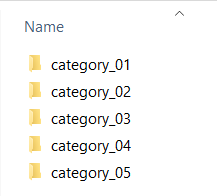

# convert_IDX

This is a small Python package which allows you to easily read and write IDX image datasets. The code is partially based on [this GitHub repo](https://github.com/gskielian/JPG-PNG-to-MNIST-NN-Format) and this well written [Medium article](https://medium.com/@mannasiladittya/converting-mnist-data-in-idx-format-to-python-numpy-array-5cb9126f99f1) which outlines the underlying concept of the IDX format in more detail.
Probably the most famous dataset stored in the IDX data format is the [MNIST]((http://yann.lecun.com/exdb/mnist/)) dataset by [Yann LeCun](http://yann.lecun.com/). If you are not familiar with the way data is stored in the IDX format it can be tricky to load the data together with its labels. This package provides simple methods which let you read IDX datasets. Also it allows you to create your own datasets with just one line of code. The examples below illustrate the general usage.

## Installation

Clone the repository directly from the Github webpage and run the following command(s) in your terminal:

```
git clone https://github.com/akcarsten/convert_IDX.git
```

Then go to the folder to which you cloned the repository and run:

```
python setup.py install
```

Now you can run Python and import the IDX converter as follows.

```
from idx_tools import Idx
```

## Loading the MNIST dataset

The famous MNIST dataset of handwritten digits by [Yann LeCun](http://yann.lecun.com/) is saved in the IDX data format.
In order to work with it you first need to [download](http://yann.lecun.com/exdb/mnist/) and unpack the data files. Afterwards you can easily import the images with the IDX tools provided here:

```
from idx_tools import Idx
import matplotlib.pyplot as plt

# Read the data
mnist_data = Idx.load_idx('./mnist/train-images.idx3-ubyte')

# Plot a random image
plt.imshow(mnist_data[2034], cmap='gray')
```


## Loading the MNIST labels

But reading the images is only the first part. In order to use the dataset for machine learning purposes we also need to have the labels. This means which image belongs to which category. In this case categories are the digits from 0 to 9.
In order to load the labels you first need to download and unpack them as we did with the image data. Then we can import the labels as follows.

```
mnist_labels = Idx.load_labels('./mnist/train-labels-idx1-ubyte')
```

## Converting your own dataset to the IDX format

Last but not least you may want to create your own dataset in the same style as the MNIST dataset. This can also be easily done with the IDX tools in this repository.
First you need to organize your image data in different folders. Each folder contains images of one category as exemplified below.



**NOTE:** Images can have any size you wish but they all need to have the same size.

Let's assume all of these folders are in a directory called "dataset". Than you can run the following python command to convert everything to the IDX data format.

```
Idx.save_idx('./dataset/')
```
The output will be two files in the data folder, one contains the images (images.idx3-ubyte) the other one contains the labels (labels.idx3-ubyte)
